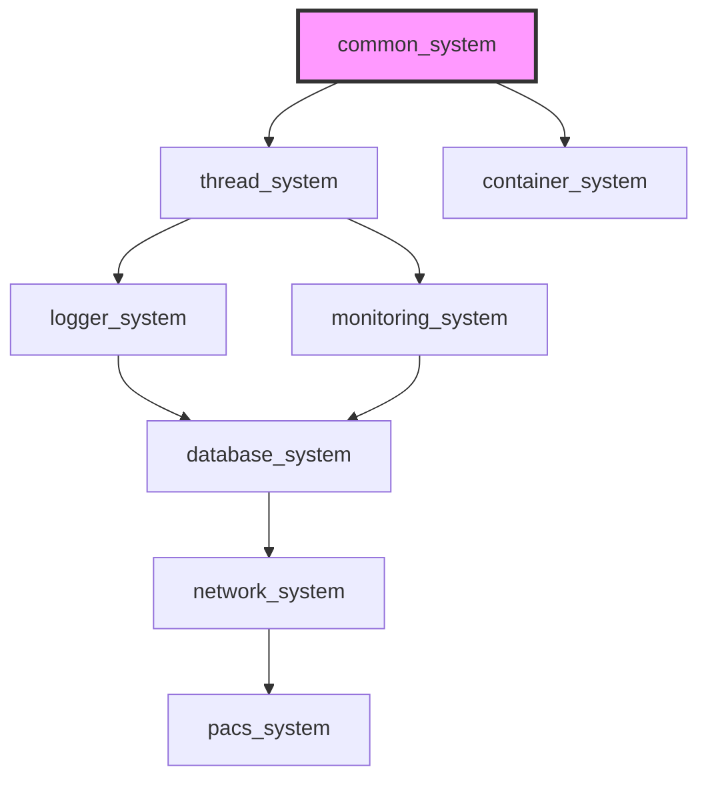

[](https://github.com/kcenon/common_system/actions/workflows/ci.yml)
[](https://github.com/kcenon/common_system/actions/workflows/coverage.yml)
[](https://github.com/kcenon/common_system/actions/workflows/static-analysis.yml)
[](https://github.com/kcenon/common_system/actions/workflows/ecosystem-vcpkg-integration.yml)
[](https://codecov.io/gh/kcenon/common_system)
[](https://github.com/kcenon/common_system/actions/workflows/build-Doxygen.yaml)
[](https://github.com/kcenon/common_system/blob/main/LICENSE)

# Common System

> **Language:** **English** | [한국어](README.kr.md)

## Table of Contents

- [Overview](#overview)
- [Key Features](#key-features)
- [Quick Start](#quick-start)
- [Requirements](#requirements)
- [Installation](#installation)
- [Architecture](#architecture)
- [Core Concepts](#core-concepts)
- [API Overview](#api-overview)
- [Examples](#examples)
- [Performance](#performance)
- [Ecosystem Integration](#ecosystem-integration)
- [Compliance](#compliance)
- [Contributing](#contributing)
- [License](#license)

---

## Overview

A foundational C++20 header-only library providing essential interfaces and design patterns for building modular, loosely-coupled system architectures. Designed as the cornerstone of the ecosystem, it enables seamless integration between system modules while maintaining zero runtime overhead through template-based abstractions and interface-driven design.

**Key Value Propositions**:
- **Zero-overhead abstractions**: Template-based interfaces with compile-time resolution
- **Well-tested**: 80%+ test coverage, zero sanitizer warnings, full CI/CD
- **Header-only design**: No library linking, no dependencies, instant integration
- **C++20 Module support**: Optional module-based build for faster compilation
- **Ecosystem foundation**: Powers thread_system, network_system, database_system, and more

**v1.0.0** — Stable API release. All public headers are frozen under SemVer guarantees.
Breaking changes will only occur in future major versions (v2.0+).

### API Stability

Starting with v1.0.0, common_system provides the following guarantees:

- **No breaking changes** to public headers within the same major version
- **No removal** of public functions, classes, or type aliases without a major version bump
- **Stable CMake targets**: `common_system::common_system`, `kcenon::common_system`, `kcenon::common`
- **Stable `#include` paths**: All headers under `kcenon/common/` are part of the public API
- **Result\<T\> as primary error handling**: Public APIs return `Result<T>` instead of throwing exceptions. The `unwrap()` method intentionally throws when called on an error result (Rust-style panic semantics)

See [VERSIONING.md](VERSIONING.md) for the full versioning policy and release process.

---

## Key Features

| Category | Feature | Description | Status |
|----------|---------|-------------|--------|
| **Patterns** | Result<T> | Rust-inspired monadic error handling (and_then, map, or_else) | Stable |
| **Patterns** | Circuit Breaker | Resilience pattern with CLOSED/OPEN/HALF_OPEN states | Stable |
| **Patterns** | Event Bus | Thread-safe synchronous pub/sub | Stable |
| **Interfaces** | IExecutor / IJob | Universal task execution abstraction | Stable |
| **Interfaces** | ILogger / IMetricCollector | Monitoring and logging interfaces | Stable |
| **DI** | Service Container | Thread-safe DI with singleton/transient/scoped lifetimes | Stable |
| **Config** | Config Loader / Watcher | Configuration management with file watching | Stable |
| **Config** | CLI Parser | Command-line argument parsing | Stable |
| **Utils** | Circular Buffer / Object Pool | High-performance utility data structures | Stable |
| **Concepts** | C++20 Concepts | Resultable, Unwrappable, callable, container, etc. | Stable |

---

## Quick Start

```cpp
#include <kcenon/common/patterns/result.h>

using namespace kcenon::common;

Result<Config> load_config(const std::string& path) {
    if (!std::filesystem::exists(path)) {
        return make_error<Config>(
            error_codes::NOT_FOUND,
            "Configuration file not found",
            "config_loader"
        );
    }
    auto config = parse_json_file(path);
    return ok(config);
}

// Usage with monadic operations
auto result = load_config("app.conf")
    .and_then(validate_config)
    .map(apply_defaults);
```

[Full Getting Started Guide](docs/guides/QUICK_START.md)

---

## Requirements

| Dependency | Version | Required | Description |
|------------|---------|----------|-------------|
| C++20 Compiler | GCC 11+ / Clang 14+ / MSVC 2022+ / Apple Clang 14+ | Yes | C++20 features (concepts) |
| CMake | 3.28+ | Yes | Build system |

### Compiler Requirements

common_system enforces minimum compiler versions at CMake configure time via
`KcenonCompilerRequirements.cmake`. Downstream systems can include this module
for consistent enforcement.

| Build Mode | GCC | Clang | MSVC | Apple Clang |
|------------|-----|-------|------|-------------|
| **Header-only** (default) | 11+ | 14+ | 2022 (19.30+) | 14+ |
| **C++20 Modules** (optional) | 14+ | 16+ | 2022 17.4 (19.34+) | Not supported |

### Ecosystem-Wide Compiler Requirements

When using multiple systems together, use the **highest** requirement from your dependency chain:

| Usage Scenario | GCC | Clang | MSVC | Apple Clang | Notes |
|----------------|-----|-------|------|-------------|-------|
| common_system only | 11+ | 14+ | 2022+ | 14+ | Baseline |
| + thread_system | **13+** | **17+** | 2022+ | 14+ | Higher requirements |
| + logger_system | 11+ | 14+ | 2022+ | 14+ | Optional thread_system |
| + container_system | 11+ | 14+ | 2022+ | 14+ | Uses common_system |
| + monitoring_system | **13+** | **17+** | 2022+ | 14+ | Requires thread_system |
| + database_system | **13+** | **17+** | 2022+ | 14+ | Full ecosystem |
| + network_system | **13+** | **17+** | 2022+ | 14+ | Requires thread_system |

> **Note**: If using any system that depends on thread_system, you need GCC 13+ or Clang 17+.
> All systems can include `KcenonCompilerRequirements.cmake` from common_system for
> automated version enforcement at configure time.

### Dependency Flow

```
common_system (Foundation Layer - No Dependencies)
       |
       | provides interfaces to
       |
       +-- thread_system (implements IExecutor)
       +-- logger_system (uses Result<T>)
       +-- container_system (uses Result<T>)
       +-- monitoring_system (event bus)
       +-- network_system (uses IExecutor)
       +-- database_system (uses Result<T> and IExecutor)
```

---

## Installation

### Installation via vcpkg

```bash
vcpkg install kcenon-common-system
```

In your `CMakeLists.txt`:
```cmake
find_package(common_system CONFIG REQUIRED)
target_link_libraries(your_target PRIVATE kcenon::common_system)
```

### CMake FetchContent (Recommended)

```cmake
include(FetchContent)
FetchContent_Declare(
    common_system
    GIT_REPOSITORY https://github.com/kcenon/common_system.git
    GIT_TAG v1.0.0
)
FetchContent_MakeAvailable(common_system)

target_link_libraries(your_target PRIVATE kcenon::common)
```

### Header-Only Usage (Simplest)

```bash
git clone https://github.com/kcenon/common_system.git
# Include headers directly - no build required!
```

```cpp
#include <kcenon/common/interfaces/executor_interface.h>
#include <kcenon/common/patterns/result.h>
```

### C++20 Modules

```bash
# Build with C++20 module support (requires CMake 3.28+, Ninja, Clang 16+/GCC 14+)
cmake -G Ninja -B build -DCOMMON_BUILD_MODULES=ON
cmake --build build
```

```cpp
import kcenon.common;

int main() {
    auto result = kcenon::common::ok(42);
    if (result.is_ok()) {
        std::cout << result.value() << std::endl;
    }
    return 0;
}
```

> For the full dual-build strategy, compiler/CMake matrix, and fallback behavior,
> see the [C++20 Modules Guide](docs/guides/CXX20_MODULES.md).

---

## Architecture

### Module Structure

```
include/kcenon/common/
  adapters/       - Adapter pattern (adapter.h, smart_adapter.h)
  bootstrap/      - System bootstrapper
  concepts/       - C++20 concepts (Resultable, Unwrappable, callable, container, etc.)
  config/         - Feature flags, ABI version, config loader/watcher, CLI parser
  di/             - Dependency injection (service_container, unified_bootstrapper)
  error/          - Error codes and error category system
  interfaces/     - Core abstractions (IExecutor, IJob, ILogger, IDatabase, IThreadPool, etc.)
  logging/        - Log functions and macros
  patterns/       - Result<T>, event_bus
  resilience/     - Circuit breaker (CLOSED/OPEN/HALF_OPEN state machine)
  utils/          - Circular buffer, object pool, enum serialization
```

### Ecosystem Position

```
                    +------------------+
                    |  common_system   | <-- Foundation Layer
                    |  (interfaces)    |
                    +--------+---------+
                             | provides interfaces
       +---------------------+---------------------+
       |                     |                     |
+------v-------+    +--------v--------+   +-------v--------+
|thread_system |    |network_system   |   |monitoring_sys. |
|(implements   |    |(uses IExecutor) |   |(event bus)     |
| IExecutor)   |    +-----------------+   +----------------+
+--------------+             |                     |
       |                     |                     |
       +---------------------+---------------------+
                             | all use
                    +--------v---------+
                    | Result<T> pattern|
                    | Error handling   |
                    +------------------+
```

[Complete Architecture Guide](docs/ARCHITECTURE.md)

### Layout Standard

The kcenon ecosystem follows a canonical directory, build-system, and test-infrastructure layout defined in [kcenon-system-layout.md](docs/kcenon-system-layout.md). This standard governs all eight ecosystem systems and is owned by `common_system` as the foundation tier.

---

## Core Concepts

### Result<T> Pattern

Type-safe error handling without exceptions, inspired by Rust:

```cpp
auto result = load_config("app.conf")
    .and_then(validate_config)
    .map(apply_defaults)
    .or_else([](const auto& error) {
        log_error(error);
        return load_fallback_config();
    });
```

### IExecutor Interface

Universal task execution abstraction for any threading backend:

```cpp
class MyService {
    std::shared_ptr<common::interfaces::IExecutor> executor_;
public:
    void process_async(const Data& data) {
        auto future = executor_->submit([data]() { return process(data); });
    }
};
```

### Health Monitoring

Comprehensive health check system with dependency graph:

```cpp
auto& monitor = global_health_monitor();
auto db_check = health_check_builder()
    .name("database")
    .type(health_check_type::dependency)
    .timeout(std::chrono::seconds{5})
    .with_check([]() { /* check logic */ })
    .build();
monitor.register_check("database", db_check.value());
monitor.add_dependency("api", "database");
```

### Error Code Registry

Centralized error code registry providing system-specific ranges:

| System | Range | Purpose |
|--------|-------|---------|
| common_system | -1 to -99 | Core errors |
| thread_system | -100 to -199 | Threading errors |
| logger_system | -200 to -299 | Logging errors |
| monitoring_system | -300 to -399 | Monitoring errors |
| container_system | -400 to -499 | Container errors |
| database_system | -500 to -599 | Database errors |
| network_system | -600 to -699 | Network errors |

### Circuit Breaker

Resilience pattern for fault tolerance:

```cpp
auto breaker = circuit_breaker("db_connection", {
    .failure_threshold = 5,
    .recovery_timeout = std::chrono::seconds{30}
});
auto result = breaker.execute([&]() { return db.query("SELECT 1"); });
```

---

## API Overview

| Component | Purpose | Header |
|-----------|---------|--------|
| `Result<T>` / `VoidResult` | Monadic error handling | `patterns/result.h` |
| `IExecutor` / `IJob` | Task execution interface | `interfaces/executor_interface.h` |
| `ILogger` | Logging abstraction | `interfaces/logger_interface.h` |
| `service_container` | Dependency injection | `di/service_container.h` |
| `simple_event_bus` | Synchronous pub/sub | `patterns/event_bus.h` |
| `circuit_breaker` | Resilience pattern | `resilience/circuit_breaker.h` |
| `config_loader` | Configuration management | `config/config_loader.h` |
| `circular_buffer` | Fixed-size ring buffer | `utils/circular_buffer.h` |
| `object_pool` | Object pooling | `utils/object_pool.h` |

[Complete API Reference](docs/API_REFERENCE.md)

---

## Examples

| Example | Description | Difficulty |
|---------|-------------|------------|
| [result_example](examples/result_example.cpp) | Result<T> error handling patterns | Beginner |
| [executor_example](examples/executor_example.cpp) | Executor interface and thread management | Beginner |
| [abi_version_example](examples/abi_version_example.cpp) | ABI version checking and compatibility | Intermediate |
| [unwrap_demo](examples/unwrap_demo.cpp) | Result unwrapping and chaining | Intermediate |
| [multi_system_app](examples/multi_system_app/) | Multi-system integration example | Advanced |

### Running Examples

```bash
cmake -B build -DCOMMON_BUILD_EXAMPLES=ON
cmake --build build
./build/examples/result_example
```

---

## Performance

| Operation | Time (ns) | Allocations | Notes |
|-----------|-----------|-------------|-------|
| Result<T> creation | 2.3 | 0 | Stack-only operation |
| Result<T> error check | 0.8 | 0 | Single bool check |
| IExecutor submit | 45.2 | 1 | Task queue insertion |
| Event publish | 12.4 | 0 | Lock-free operation |

**Key Performance Characteristics:**
- Result<T> is 400x faster than exceptions in error paths
- IExecutor is 53x faster than std::async for high-frequency tasks
- Zero-overhead abstractions - compiler optimizes away all abstraction layers

**Quality Metrics**:
- **Test coverage**: 80%+ (target: 85%)
- **Sanitizer tests**: 18/18 passing with zero warnings
- **Cross-platform**: Ubuntu, macOS, Windows
- **Zero memory leaks**: AddressSanitizer verified
- **Zero data races**: ThreadSanitizer verified
- **RAII Grade: A** - All resources managed through smart pointers

[Full Benchmarks](docs/BENCHMARKS.md)

---

## Ecosystem Integration

### Ecosystem Dependency Map



> **Ecosystem reference**:
> [thread_system](https://github.com/kcenon/thread_system) — Tier 1: Implements IExecutor interface
> [container_system](https://github.com/kcenon/container_system) — Tier 1: Uses Result&lt;T&gt; for error handling
> [logger_system](https://github.com/kcenon/logger_system) — Tier 2: Uses ILogger, Result&lt;T&gt;
> [monitoring_system](https://github.com/kcenon/monitoring_system) — Tier 3: Uses event bus, IMonitor
> [database_system](https://github.com/kcenon/database_system) — Tier 3: Uses Result&lt;T&gt;, IExecutor
> [network_system](https://github.com/kcenon/network_system) — Tier 4: Uses IExecutor, Result&lt;T&gt;
> [pacs_system](https://github.com/kcenon/pacs_system) — Tier 5: Full ecosystem consumer

### Ecosystem Version Baseline

Downstream consumers should pin against a known-good set of port versions. The current baseline is published in [`docs/ECOSYSTEM_OVERVIEW.md#versions`](docs/ECOSYSTEM_OVERVIEW.md#versions) with a reproducible `vcpkg-configuration.json` snippet.

### Ecosystem CI Verification

The [Ecosystem vcpkg Integration](https://github.com/kcenon/common_system/actions/workflows/ecosystem-vcpkg-integration.yml) workflow validates that all 8 ecosystem ports install and build correctly as a consumer would experience them. It tests each port in bottom-up dependency order (Layer 0 through Layer 7) on Ubuntu and macOS, running on every PR that touches vcpkg ports and nightly at 03:00 UTC.

This common system serves as the foundational layer (Tier 0) that all other system modules build upon:

```
common_system (Tier 0 - Foundation)
       |
       +-- thread_system     (Tier 1) - Implements IExecutor
       +-- container_system  (Tier 1) - Uses Result<T>
       +-- logger_system     (Tier 2) - Uses ILogger, Result<T>
       +-- monitoring_system (Tier 3) - Uses Event Bus
       +-- database_system   (Tier 3) - Uses Result<T>, IExecutor
       +-- network_system    (Tier 4) - Uses IExecutor
       +-- pacs_system       (Tier 5) - Full ecosystem consumer
```

### Integration Example

```cpp
// Any ecosystem project can use common_system interfaces
#include <kcenon/common/patterns/result.h>
#include <kcenon/common/interfaces/executor_interface.h>

// Result<T> is the universal error handling pattern
auto result = do_something();
if (result.is_err()) {
    // Consistent error handling across all projects
    auto error = result.error();
    std::cerr << error.message << " (code: " << error.code << ")\n";
}
```

### Documentation

| Category | Document | Description |
|----------|----------|-------------|
| **Guides** | [Quick Start](docs/guides/QUICK_START.md) | Get up and running in minutes |
| | [Best Practices](docs/guides/BEST_PRACTICES.md) | Recommended usage patterns |
| | [FAQ](docs/guides/FAQ.md) | Frequently asked questions |
| | [Troubleshooting](docs/guides/TROUBLESHOOTING.md) | Common issues and solutions |
| **Advanced** | [C++20 Modules Guide](docs/guides/CXX20_MODULES.md) | Dual-build strategy and toolchain matrix |
| | [Architecture](docs/ARCHITECTURE.md) | System design and principles |
| | [Migration](docs/advanced/MIGRATION.md) | Version upgrade guide |
| | [IExecutor Migration](docs/advanced/IEXECUTOR_MIGRATION_GUIDE.md) | Executor API migration |
| | [Runtime Binding](docs/architecture/RUNTIME_BINDING.md) | Core design pattern |
| **Contributing** | [Contributing](CONTRIBUTING.md) | How to contribute |
| | [Error Code Guidelines](docs/guides/ERROR_CODE_GUIDELINES.md) | Error code management |

---

## Compliance

`common_system` and its ecosystem siblings provide technical primitives that organizations may use as part of their compliance programs. The libraries are not themselves certified; adopters integrate them and supply the organizational controls.

- [ISO Standards Overview](docs/compliance/ISO_OVERVIEW.md) — ecosystem-level index of every ISO standard the kcenon systems touch, with links to per-system mapping documents.

Per-system compliance docs are published under each repository's `docs/compliance/` directory (e.g., [logger_system ISO/IEC 27001 mapping](https://github.com/kcenon/logger_system/blob/develop/docs/compliance/iso-27001.md)). See the overview for the full list.

---

## Contributing

We welcome contributions! Please see [CONTRIBUTING.md](docs/contributing/CONTRIBUTING.md) for guidelines.

### Quick Links

- [Development Setup](docs/contributing/CONTRIBUTING.md#development-setup)
- [Code Style](docs/contributing/CONTRIBUTING.md#code-style-guidelines)
- [Pull Request Process](docs/contributing/CONTRIBUTING.md#submitting-changes)

### Support

- **Issues**: [GitHub Issues](https://github.com/kcenon/common_system/issues)
- **Discussions**: [GitHub Discussions](https://github.com/kcenon/common_system/discussions)
- **Email**: kcenon@naver.com

---

## License

This project is licensed under the BSD 3-Clause License - see the [LICENSE](LICENSE) file for details.

---

<p align="center">
  Made with care by the kcenon team
</p>
