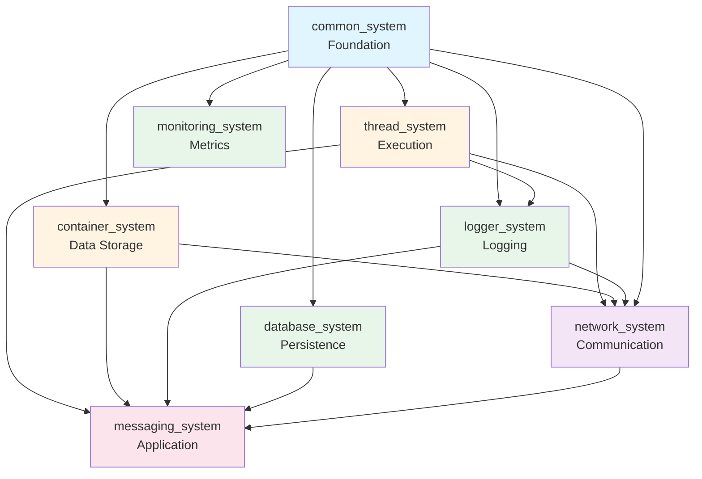

> **Language:** **English** | [한국어](ARCHITECTURE_KO.md)

# System Architecture

## Overview

This document describes the architecture of the 7 core systems and how they integrate with each other.

## Layer Architecture

```
┌─────────────────────────────────────────────────────────────┐
│                   Application Layer                         │
│            (messaging_system, custom applications)          │
└─────────────────────────────────────────────────────────────┘
                              │
┌─────────────────────────────────────────────────────────────┐
│                Layer 3: Integration Systems                 │
│  ┌───────────────────────────────────────────────────────┐  │
│  │               network_system                          │  │
│  │  (TCP/IP communication, asynchronous messaging)       │  │
│  └───────────────────────────────────────────────────────┘  │
└─────────────────────────────────────────────────────────────┘
                              │
┌─────────────────────────────────────────────────────────────┐
│                Layer 2: Service Systems                     │
│  ┌──────────────┐  ┌──────────────┐  ┌──────────────┐      │
│  │logger_system │  │monitoring_   │  │database_     │      │
│  │   (logging)  │  │   system     │  │  system      │      │
│  │              │  │  (metrics)   │  │(persistence) │      │
│  └──────────────┘  └──────────────┘  └──────────────┘      │
└─────────────────────────────────────────────────────────────┘
                              │
┌─────────────────────────────────────────────────────────────┐
│                Layer 1: Core Systems                        │
│  ┌──────────────────┐      ┌──────────────────┐            │
│  │  thread_system   │      │ container_system │            │
│  │   (execution,    │      │  (data storage,  │            │
│  │  job scheduling) │      │  serialization)  │            │
│  └──────────────────┘      └──────────────────┘            │
└─────────────────────────────────────────────────────────────┘
                              │
┌─────────────────────────────────────────────────────────────┐
│              Layer 0: Foundation (common_system)            │
│  ┌─────────────────────────────────────────────────────┐   │
│  │  Standard Interfaces:                               │   │
│  │  • ILogger      - Logging interface                 │   │
│  │  • IMonitor     - Monitoring interface              │   │
│  │  • IExecutor    - Execution interface               │   │
│  │  • Result<T>    - Type-safe error handling          │   │
│  │  • VoidResult   - Error handling for void ops       │   │
│  └─────────────────────────────────────────────────────┘   │
└─────────────────────────────────────────────────────────────┘
```

## System Dependencies

### Dependency Graph



### Dependency Table

| System | Required Dependencies | Optional Dependencies |
|--------|----------------------|----------------------|
| common_system | None | None |
| thread_system | common_system (opt) | fmt library |
| container_system | common_system (opt) | None |
| logger_system | common_system, thread_system | fmt library |
| monitoring_system | common_system | logger_system |
| database_system | common_system (opt), container_system | PostgreSQL, MySQL, MongoDB |
| network_system | ASIO, container_system, thread_system, logger_system | common_system (ON by default) |

## Component Architecture

### common_system (Foundation)

```
common_system/
├── interfaces/
│   ├── logger_interface.h      # ILogger standard interface
│   ├── monitoring_interface.h  # IMonitor standard interface
│   └── executor_interface.h    # IExecutor standard interface
├── patterns/
│   ├── result.h                # Result<T> pattern
│   ├── error.h                 # Error types
│   └── factory.h               # Factory patterns
└── utilities/
    ├── type_traits.h           # Type utilities
    └── concepts.h              # C++20 concepts
```

**Responsibilities**:
- Define standard interfaces for cross-system communication
- Provide type-safe error handling with Result<T>
- Establish common patterns (factory, DI)

### thread_system (Execution)

```
thread_system/
├── core/
│   ├── thread_pool.h           # Thread pool implementation
│   ├── thread_worker.h         # Worker thread management
│   ├── job.h                   # Job abstraction
│   └── job_queue.h             # Lock-free job queue
├── interfaces/
│   ├── executor_interface.h    # IExecutor implementation
│   └── logger_interface.h      # ILogger adapter
└── utils/
    └── thread_utils.h          # Thread utilities
```

**Responsibilities**:
- Provide thread pool for concurrent execution
- Implement IExecutor interface for task submission
- Manage job queues and worker threads

### container_system (Data Storage)

```
container_system/
├── core/
│   ├── container.h             # Generic key-value container
│   ├── value.h                 # Type-safe value wrapper
│   └── serializer.h            # Serialization support
└── utilities/
    └── type_converter.h        # Type conversion utilities
```

**Responsibilities**:
- Provide generic data container
- Support serialization/deserialization
- Enable type-safe data storage

### logger_system (Logging)

```
logger_system/
├── core/
│   ├── logger.h                # Main logger class
│   ├── log_entry.h             # Log entry structure
│   └── log_level.h             # Log level definitions
├── writers/
│   ├── console_writer.h        # Console output
│   ├── file_writer.h           # File output
│   └── rotating_file_writer.h  # Rotating file support
└── impl/
    └── async/
        └── batch_processor.h   # Asynchronous batch processing
```

**Responsibilities**:
- Implement ILogger interface
- Provide asynchronous logging with batching
- Support multiple output targets

### monitoring_system (Metrics)

```
monitoring_system/
├── core/
│   ├── performance_monitor.h   # Performance monitoring
│   ├── metrics_collector.h     # Metrics collection
│   └── health_monitor.h        # Health checking
└── interfaces/
    └── monitoring_interface.h  # IMonitor implementation
```

**Responsibilities**:
- Implement IMonitor interface
- Collect and aggregate metrics
- Provide health status monitoring

### database_system (Persistence)

```
database_system/
├── core/
│   ├── database_manager.h      # Database connection management
│   ├── query_builder.h         # SQL query builder
│   └── transaction.h           # Transaction support
└── adapters/
    ├── postgresql_adapter.h    # PostgreSQL support
    ├── mysql_adapter.h         # MySQL support
    └── mongodb_adapter.h       # MongoDB support
```

**Responsibilities**:
- Provide database abstraction layer
- Support multiple database backends
- Enable transaction management

### network_system (Communication)

```
network_system/
├── core/
│   ├── messaging_server.h      # TCP server
│   ├── messaging_client.h      # TCP client
│   └── messaging_session.h     # Connection session
├── integration/
│   ├── logger_integration.h    # Logger integration
│   ├── thread_integration.h    # Thread pool integration
│   └── container_integration.h # Container integration
└── internal/
    ├── tcp_socket.h            # Socket abstraction
    └── pipeline.h              # Data pipeline
```

**Responsibilities**:
- Provide asynchronous TCP/IP communication
- Integrate with thread_system for concurrent connections
- Use logger_system for diagnostics

## Data Flow Examples

### Example 1: Network Message Processing

```
Client Request
     │
     ▼
network_system::messaging_server
     │
     ├─► logger_system::logger ──► "Connection received"
     │
     ├─► thread_system::thread_pool ──► Process in worker thread
     │        │
     │        ▼
     │   container_system::container ──► Parse message data
     │        │
     │        ▼
     │   Application Logic
     │        │
     │        ▼
     │   database_system::save() ──► Persist data
     │        │
     │        └─► Result<void>
     │
     └─► monitoring_system::record_metric("messages_processed", 1)
```

### Example 2: Logging with Monitoring

```
Application Code
     │
     ▼
logger_system::logger::log()
     │
     ├─► monitoring_system::record_metric("log_count", 1)
     │
     ├─► thread_system::job_queue ──► Async batch processing
     │        │
     │        ▼
     │   logger_system::batch_processor
     │        │
     │        ├─► console_writer::write()
     │        ├─► file_writer::write()
     │        └─► network_writer::send()
     │
     └─► Result<void>
```

## Integration Patterns

### Pattern 1: Dependency Injection

```cpp
// Create infrastructure
auto logger = kcenon::logger::create_logger();
auto thread_pool = kcenon::thread::create_thread_pool(4);
auto monitor = kcenon::monitoring::create_monitor();

// Inject dependencies
auto server = network_system::create_messaging_server(8080);
server->set_logger(logger.get());
server->set_executor(thread_pool.get());
server->set_monitor(monitor.get());
```

### Pattern 2: Result<T> Error Handling

```cpp
// Database operation with Result<T>
auto result = database_manager->execute_query("SELECT * FROM users");

if (common::is_ok(result)) {
    auto data = common::get_value(result);
    // Process data
} else {
    auto error = common::get_error(result);
    logger->log(log_level::error,
        std::format("Database error: {} (code: {})",
                    error.message,
                    static_cast<int>(error.code)));
}
```

### Pattern 3: Interface Abstraction

```cpp
// Use ILogger interface for flexibility
void process_request(common::interfaces::ILogger* logger) {
    logger->log(log_level::info, "Processing request");
    // Implementation can use console_logger, file_logger, etc.
}
```

## Build Configuration

### CMake Integration

```cmake
# Find systems
find_package(common_system CONFIG REQUIRED)
find_package(thread_system CONFIG REQUIRED)
find_package(logger_system CONFIG REQUIRED)
find_package(container_system CONFIG REQUIRED)

# Create application
add_executable(MyApp main.cpp)

# Link systems
target_link_libraries(MyApp PRIVATE
    kcenon::common_system
    kcenon::thread_system
    kcenon::logger_system
    kcenon::container_system
)
```

### Build Modes

All systems support multiple build configurations:

| Mode | Description | CMake Flag |
|------|-------------|------------|
| **Integrated** | Full integration with common_system | `BUILD_WITH_COMMON_SYSTEM=ON` |
| **Standalone** | Independent operation (Tier 2 only) | `BUILD_WITH_COMMON_SYSTEM=OFF` |
| **Debug** | Debug symbols, no optimization | `CMAKE_BUILD_TYPE=Debug` |
| **Release** | Optimized, no debug symbols | `CMAKE_BUILD_TYPE=Release` |

## Performance Characteristics

### Thread Safety

| System | Thread-Safe | Lock Strategy |
|--------|-------------|---------------|
| common_system | N/A | Interfaces only |
| thread_system | ✅ Yes | Lock-free queues |
| container_system | ⚠️ Partial | User responsibility |
| logger_system | ✅ Yes | Lock-free batching |
| monitoring_system | ✅ Yes | Atomic operations |
| database_system | ✅ Yes | Connection pooling |
| network_system | ✅ Yes | Per-session locking |

### Scalability

- **thread_system**: Scales to hundreds of concurrent jobs
- **logger_system**: Handles 1M+ logs/sec with batching
- **network_system**: Supports thousands of concurrent connections
- **database_system**: Connection pooling for high throughput
- **monitoring_system**: Low overhead (< 1% CPU)

## Version Compatibility

All systems follow Semantic Versioning (SemVer):

- **Major**: Breaking API changes
- **Minor**: New features, backward compatible
- **Patch**: Bug fixes

Current versions aligned to **v1.0.0** baseline (2025-10-03).

## References

- [INTEGRATION_POLICY.md](./INTEGRATION_POLICY.md) - Integration policy
- [INTEGRATION.md](./INTEGRATION.md) - Integration examples
- [NEED_TO_FIX.md](./NEED_TO_FIX.md) - Improvement tracking
