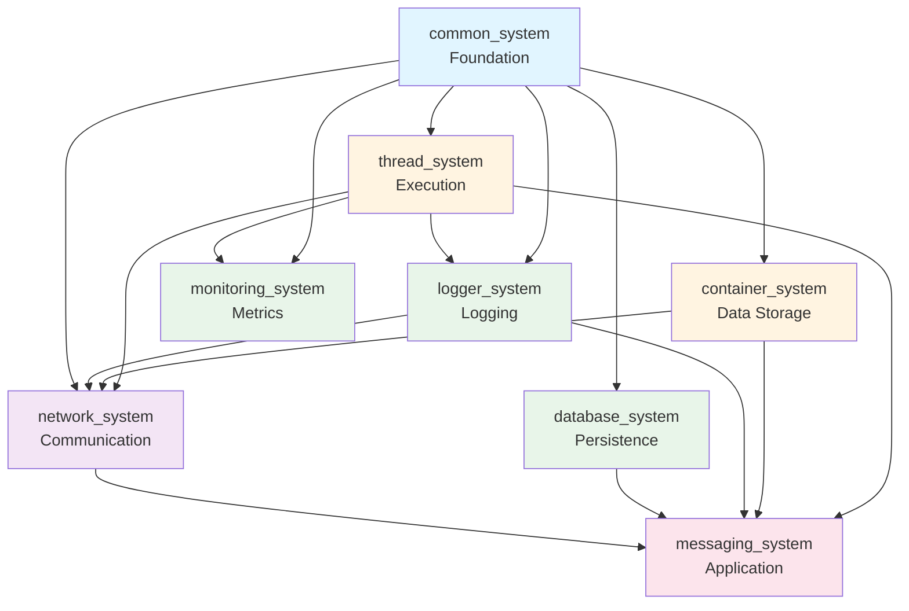
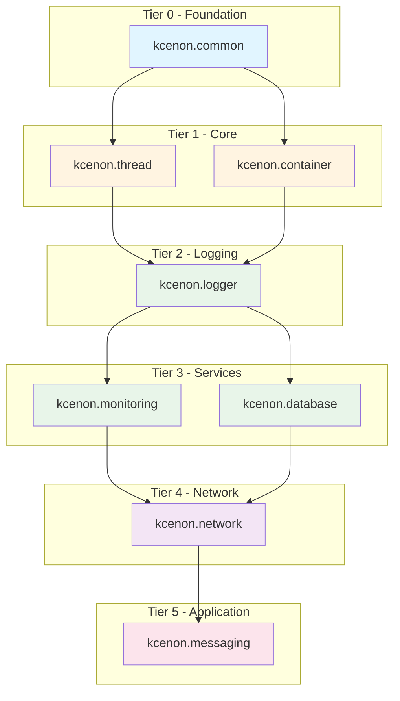

> **Language:** **English** | [한국어](ARCHITECTURE.kr.md)

# System Architecture

## Overview

This document describes the architecture of the 7 core systems and how they integrate with each other.

## Layer Architecture

```
┌─────────────────────────────────────────────────────────────┐
│                   Application Layer                         │
│            (messaging_system, custom applications)          │
└─────────────────────────────────────────────────────────────┘
                              │
┌─────────────────────────────────────────────────────────────┐
│                Layer 3: Integration Systems                 │
│  ┌───────────────────────────────────────────────────────┐  │
│  │               network_system                          │  │
│  │  (TCP/IP communication, asynchronous messaging)       │  │
│  └───────────────────────────────────────────────────────┘  │
└─────────────────────────────────────────────────────────────┘
                              │
┌─────────────────────────────────────────────────────────────┐
│                Layer 2: Service Systems                     │
│  ┌──────────────┐  ┌──────────────┐  ┌──────────────┐      │
│  │logger_system │  │monitoring_   │  │database_     │      │
│  │   (logging)  │  │   system     │  │  system      │      │
│  │              │  │  (metrics)   │  │(persistence) │      │
│  └──────────────┘  └──────────────┘  └──────────────┘      │
└─────────────────────────────────────────────────────────────┘
                              │
┌─────────────────────────────────────────────────────────────┐
│                Layer 1: Core Systems                        │
│  ┌──────────────────┐      ┌──────────────────┐            │
│  │  thread_system   │      │ container_system │            │
│  │   (execution,    │      │  (data storage,  │            │
│  │  job scheduling) │      │  serialization)  │            │
│  └──────────────────┘      └──────────────────┘            │
└─────────────────────────────────────────────────────────────┘
                              │
┌─────────────────────────────────────────────────────────────┐
│              Layer 0: Foundation (common_system)            │
│  ┌─────────────────────────────────────────────────────┐   │
│  │  Standard Interfaces:                               │   │
│  │  • ILogger      - Logging interface                 │   │
│  │  • IMonitor     - Monitoring interface              │   │
│  │  • IExecutor    - Execution interface               │   │
│  │  • Result<T>    - Type-safe error handling          │   │
│  │  • VoidResult   - Error handling for void ops       │   │
│  └─────────────────────────────────────────────────────┘   │
└─────────────────────────────────────────────────────────────┘
```

## System Dependencies

### Dependency Graph



### Dependency Details

> **Authoritative source**: Each system's `CMakeLists.txt` header comments define the
> canonical dependency list. Refer to per-system documentation for current details:
>
> | System | Documentation |
> |--------|--------------|
> | [common_system](https://github.com/kcenon/common_system) | Foundation — no dependencies |
> | [thread_system](https://github.com/kcenon/thread_system) | See `CMakeLists.txt` and `docs/ARCHITECTURE.md` |
> | [container_system](https://github.com/kcenon/container_system) | See `CMakeLists.txt` and `docs/ARCHITECTURE.md` |
> | [logger_system](https://github.com/kcenon/logger_system) | See `CMakeLists.txt` and `docs/ARCHITECTURE.md` |
> | [monitoring_system](https://github.com/kcenon/monitoring_system) | See `CMakeLists.txt` and `docs/ARCHITECTURE.md` |
> | [database_system](https://github.com/kcenon/database_system) | See `CMakeLists.txt` and `docs/ARCHITECTURE.md` |
> | [network_system](https://github.com/kcenon/network_system) | See `CMakeLists.txt` and `docs/ARCHITECTURE.md` |

## Data Flow Examples

### Example 1: Network Message Processing

```
Client Request
     │
     ▼
network_system::messaging_server
     │
     ├─► logger_system::logger ──► "Connection received"
     │
     ├─► thread_system::thread_pool ──► Process in worker thread
     │        │
     │        ▼
     │   container_system::container ──► Parse message data
     │        │
     │        ▼
     │   Application Logic
     │        │
     │        ▼
     │   database_system::save() ──► Persist data
     │        │
     │        └─► Result<void>
     │
     └─► monitoring_system::record_metric("messages_processed", 1)
```

### Example 2: Logging with Monitoring

```
Application Code
     │
     ▼
logger_system::logger::log()
     │
     ├─► monitoring_system::record_metric("log_count", 1)
     │
     ├─► thread_system::job_queue ──► Async batch processing
     │        │
     │        ▼
     │   logger_system::batch_processor
     │        │
     │        ├─► console_writer::write()
     │        ├─► file_writer::write()
     │        └─► network_writer::send()
     │
     └─► Result<void>
```

## Integration Patterns

### Pattern 1: Dependency Injection

```cpp
// Create infrastructure
auto logger = kcenon::logger::create_logger();
auto thread_pool = kcenon::thread::create_thread_pool(4);
auto monitor = kcenon::monitoring::create_monitor();

// Inject dependencies
auto server = network_system::create_messaging_server(8080);
server->set_logger(logger.get());
server->set_executor(thread_pool.get());
server->set_monitor(monitor.get());
```

### Pattern 2: Result<T> Error Handling

```cpp
// Database operation with Result<T>
auto result = database_manager->execute_query("SELECT * FROM users");

if (common::is_ok(result)) {
    auto data = common::get_value(result);
    // Process data
} else {
    auto error = common::get_error(result);
    logger->log(log_level::error,
        std::format("Database error: {} (code: {})",
                    error.message,
                    static_cast<int>(error.code)));
}
```

### Pattern 3: Interface Abstraction

```cpp
// Use ILogger interface for flexibility
void process_request(common::interfaces::ILogger* logger) {
    logger->log(log_level::info, "Processing request");
    // Implementation can use console_logger, file_logger, etc.
}
```

## Build Configuration

### CMake Integration

```cmake
# Find systems
find_package(common_system CONFIG REQUIRED)
find_package(thread_system CONFIG REQUIRED)
find_package(logger_system CONFIG REQUIRED)
find_package(container_system CONFIG REQUIRED)

# Create application
add_executable(MyApp main.cpp)

# Link systems
target_link_libraries(MyApp PRIVATE
    kcenon::common_system
    kcenon::thread_system
    kcenon::logger_system
    kcenon::container_system
)
```

### Build Modes

All systems support multiple build configurations:

| Mode | Description | CMake Flag |
|------|-------------|------------|
| **Integrated** | Full integration with common_system | `BUILD_WITH_COMMON_SYSTEM=ON` |
| **Standalone** | Independent operation (Tier 2 only) | `BUILD_WITH_COMMON_SYSTEM=OFF` |
| **Debug** | Debug symbols, no optimization | `CMAKE_BUILD_TYPE=Debug` |
| **Release** | Optimized, no debug symbols | `CMAKE_BUILD_TYPE=Release` |

## Performance Characteristics

### Thread Safety

| System | Thread-Safe | Lock Strategy |
|--------|-------------|---------------|
| common_system | N/A | Interfaces only |
| thread_system | ✅ Yes | Lock-free queues |
| container_system | ⚠️ Partial | User responsibility |
| logger_system | ✅ Yes | Lock-free batching |
| monitoring_system | ✅ Yes | Atomic operations |
| database_system | ✅ Yes | Connection pooling |
| network_system | ✅ Yes | Per-session locking |

### Scalability

- **thread_system**: Scales to hundreds of concurrent jobs
- **logger_system**: Handles 1M+ logs/sec with batching
- **network_system**: Supports thousands of concurrent connections
- **database_system**: Connection pooling for high throughput
- **monitoring_system**: Low overhead (< 1% CPU)

## Version Compatibility

All systems follow Semantic Versioning (SemVer):

- **Major**: Breaking API changes
- **Minor**: New features, backward compatible
- **Patch**: Bug fixes

Current versions aligned to **v1.0.0** baseline (2025-10-03).

## C++20 Module Architecture

### Module Overview

C++20 modules provide an alternative to the header-only build with significant compilation speed improvements.

```
kcenon.common (Main Module)
├── :utils       ─── Tier 1: CircularBuffer, ObjectPool, source_location
├── :error       ─── Tier 1: Error codes and categories
├── :result      ─── Tier 2: Result<T> pattern implementation
├── :concepts    ─── Tier 2: C++20 concepts for type validation
├── :interfaces  ─── Tier 3: IExecutor, ILogger, IThreadPool interfaces
├── :config      ─── Tier 3: Configuration utilities
├── :di          ─── Tier 3: Dependency injection
├── :patterns    ─── Tier 4: EventBus implementation
└── :logging     ─── Tier 4: Logging utilities
```

### Module Build Dependencies



### Build Configuration

```cmake
# Enable module build
cmake -G Ninja -B build \
    -DCOMMON_BUILD_MODULES=ON \
    -DCMAKE_CXX_COMPILER=clang++

# Use module target in your project
target_link_libraries(your_app PRIVATE kcenon::common_modules)
```

### Compiler Support

| Compiler | Minimum Version | Status |
|----------|-----------------|--------|
| Clang | 16.0 | ✅ Supported |
| GCC | 14.0 | ✅ Supported |
| MSVC | 17.4 (2022) | ✅ Supported |
| AppleClang | - | ❌ Not supported |

For detailed migration instructions, see the [Module Migration Guide](guides/MODULE_MIGRATION.md).

## References

- [INTEGRATION_POLICY.md](./INTEGRATION_POLICY.md) - Integration policy
- [INTEGRATION.md](./INTEGRATION.md) - Integration examples
- [NEED_TO_FIX.md](./NEED_TO_FIX.md) - Improvement tracking
- [Module Migration Guide](guides/MODULE_MIGRATION.md) - C++20 module migration
