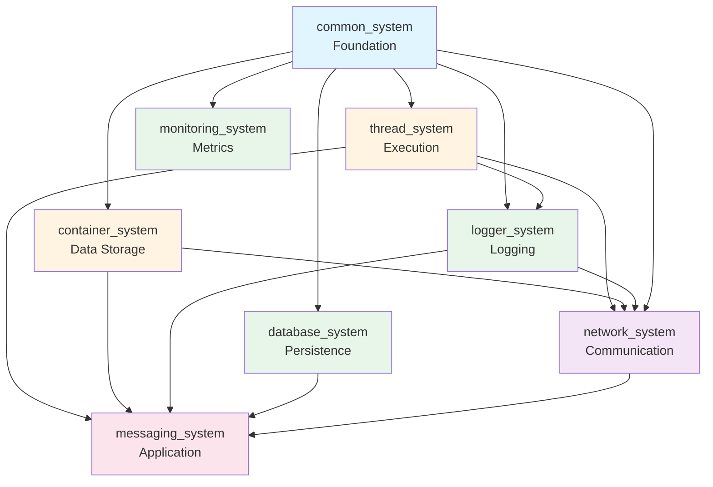
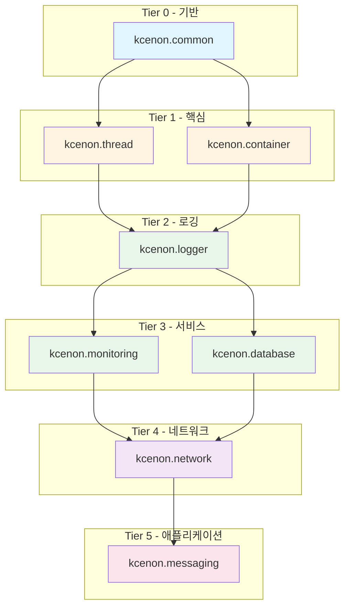

> **Language:** [English](ARCHITECTURE.md) | **한국어**

# 시스템 아키텍처

## 개요

이 문서는 7개의 핵심 시스템 아키텍처와 시스템 간 통합 방법을 설명합니다.

## 레이어 아키텍처

```
┌─────────────────────────────────────────────────────────────┐
│                   Application Layer                         │
│            (messaging_system, custom applications)          │
└─────────────────────────────────────────────────────────────┘
                              │
┌─────────────────────────────────────────────────────────────┐
│                Layer 3: Integration Systems                 │
│  ┌───────────────────────────────────────────────────────┐  │
│  │               network_system                          │  │
│  │  (TCP/IP communication, asynchronous messaging)       │  │
│  └───────────────────────────────────────────────────────┘  │
└─────────────────────────────────────────────────────────────┘
                              │
┌─────────────────────────────────────────────────────────────┐
│                Layer 2: Service Systems                     │
│  ┌──────────────┐  ┌──────────────┐  ┌──────────────┐      │
│  │logger_system │  │monitoring_   │  │database_     │      │
│  │   (logging)  │  │   system     │  │  system      │      │
│  │              │  │  (metrics)   │  │(persistence) │      │
│  └──────────────┘  └──────────────┘  └──────────────┘      │
└─────────────────────────────────────────────────────────────┘
                              │
┌─────────────────────────────────────────────────────────────┐
│                Layer 1: Core Systems                        │
│  ┌──────────────────┐      ┌──────────────────┐            │
│  │  thread_system   │      │ container_system │            │
│  │   (execution,    │      │  (data storage,  │            │
│  │  job scheduling) │      │  serialization)  │            │
│  └──────────────────┘      └──────────────────┘            │
└─────────────────────────────────────────────────────────────┘
                              │
┌─────────────────────────────────────────────────────────────┐
│              Layer 0: Foundation (common_system)            │
│  ┌─────────────────────────────────────────────────────┐   │
│  │  Standard Interfaces:                               │   │
│  │  • ILogger      - Logging interface                 │   │
│  │  • IMonitor     - Monitoring interface              │   │
│  │  • IExecutor    - Execution interface               │   │
│  │  • Result<T>    - Type-safe error handling          │   │
│  │  • VoidResult   - Error handling for void ops       │   │
│  └─────────────────────────────────────────────────────┘   │
└─────────────────────────────────────────────────────────────┘
```

## 시스템 의존성

### 의존성 그래프



### 의존성 테이블

| 시스템 | 필수 의존성 | 선택적 의존성 |
|--------|------------|--------------|
| common_system | None | None |
| thread_system | common_system (opt) | fmt library |
| container_system | common_system (opt) | None |
| logger_system | common_system, thread_system | fmt library |
| monitoring_system | common_system | logger_system |
| database_system | common_system (opt), container_system | PostgreSQL, MySQL, MongoDB |
| network_system | ASIO, container_system, thread_system, logger_system | common_system (기본값 ON) |

## 컴포넌트 아키텍처

### common_system (기반)

```
common_system/
├── interfaces/
│   ├── logger_interface.h      # ILogger 표준 인터페이스
│   ├── monitoring_interface.h  # IMonitor 표준 인터페이스
│   └── executor_interface.h    # IExecutor 표준 인터페이스
├── patterns/
│   ├── result.h                # Result<T> 패턴
│   ├── error.h                 # Error 타입
│   └── factory.h               # Factory 패턴
└── utilities/
    ├── type_traits.h           # Type 유틸리티
    └── concepts.h              # C++20 concepts
```

**책임**:
- 시스템 간 통신을 위한 표준 인터페이스 정의
- Result<T>를 사용한 타입 안전 에러 처리 제공
- 공통 패턴(factory, DI) 설정

### thread_system (실행)

```
thread_system/
├── core/
│   ├── thread_pool.h           # Thread pool 구현
│   ├── thread_worker.h         # Worker thread 관리
│   ├── job.h                   # Job 추상화
│   └── job_queue.h             # Lock-free job queue
├── interfaces/
│   ├── executor_interface.h    # IExecutor 구현
│   └── logger_interface.h      # ILogger 어댑터
└── utils/
    └── thread_utils.h          # Thread 유틸리티
```

**책임**:
- 동시 실행을 위한 thread pool 제공
- 작업 제출을 위한 IExecutor 인터페이스 구현
- Job queue와 worker thread 관리

### container_system (데이터 저장)

```
container_system/
├── core/
│   ├── container.h             # Generic key-value container
│   ├── value.h                 # Type-safe value wrapper
│   └── serializer.h            # Serialization 지원
└── utilities/
    └── type_converter.h        # Type 변환 유틸리티
```

**책임**:
- Generic 데이터 container 제공
- Serialization/deserialization 지원
- 타입 안전 데이터 저장 활성화

### logger_system (로깅)

```
logger_system/
├── core/
│   ├── logger.h                # Main logger 클래스
│   ├── log_entry.h             # Log entry 구조
│   └── log_level.h             # Log level 정의
├── writers/
│   ├── console_writer.h        # Console 출력
│   ├── file_writer.h           # File 출력
│   └── rotating_file_writer.h  # Rotating file 지원
└── impl/
    └── async/
        └── batch_processor.h   # 비동기 배치 처리
```

**책임**:
- ILogger 인터페이스 구현
- 배치를 사용한 비동기 로깅 제공
- 다중 출력 대상 지원

### monitoring_system (메트릭)

```
monitoring_system/
├── core/
│   ├── performance_monitor.h   # Performance 모니터링
│   ├── metrics_collector.h     # Metrics 수집
│   └── health_monitor.h        # Health 체크
└── interfaces/
    └── monitoring_interface.h  # IMonitor 구현
```

**책임**:
- IMonitor 인터페이스 구현
- Metrics 수집 및 집계
- Health 상태 모니터링 제공

### database_system (영속성)

```
database_system/
├── core/
│   ├── database_manager.h      # Database 연결 관리
│   ├── query_builder.h         # SQL query builder
│   └── transaction.h           # Transaction 지원
└── adapters/
    ├── postgresql_adapter.h    # PostgreSQL 지원
    ├── mysql_adapter.h         # MySQL 지원
    └── mongodb_adapter.h       # MongoDB 지원
```

**책임**:
- Database 추상화 레이어 제공
- 다중 database 백엔드 지원
- Transaction 관리 활성화

### network_system (통신)

```
network_system/
├── core/
│   ├── messaging_server.h      # TCP server
│   ├── messaging_client.h      # TCP client
│   └── messaging_session.h     # Connection session
├── integration/
│   ├── logger_integration.h    # Logger 통합
│   ├── thread_integration.h    # Thread pool 통합
│   └── container_integration.h # Container 통합
└── internal/
    ├── tcp_socket.h            # Socket 추상화
    └── pipeline.h              # Data pipeline
```

**책임**:
- 비동기 TCP/IP 통신 제공
- 동시 연결을 위한 thread_system 통합
- 진단을 위한 logger_system 사용

## 데이터 흐름 예제

### 예제 1: 네트워크 메시지 처리

```
Client Request
     │
     ▼
network_system::messaging_server
     │
     ├─► logger_system::logger ──► "Connection received"
     │
     ├─► thread_system::thread_pool ──► Process in worker thread
     │        │
     │        ▼
     │   container_system::container ──► Parse message data
     │        │
     │        ▼
     │   Application Logic
     │        │
     │        ▼
     │   database_system::save() ──► Persist data
     │        │
     │        └─► Result<void>
     │
     └─► monitoring_system::record_metric("messages_processed", 1)
```

### 예제 2: 모니터링을 포함한 로깅

```
Application Code
     │
     ▼
logger_system::logger::log()
     │
     ├─► monitoring_system::record_metric("log_count", 1)
     │
     ├─► thread_system::job_queue ──► Async batch processing
     │        │
     │        ▼
     │   logger_system::batch_processor
     │        │
     │        ├─► console_writer::write()
     │        ├─► file_writer::write()
     │        └─► network_writer::send()
     │
     └─► Result<void>
```

## 통합 패턴

### 패턴 1: Dependency Injection

```cpp
// Create infrastructure
auto logger = kcenon::logger::create_logger();
auto thread_pool = kcenon::thread::create_thread_pool(4);
auto monitor = kcenon::monitoring::create_monitor();

// Inject dependencies
auto server = network_system::create_messaging_server(8080);
server->set_logger(logger.get());
server->set_executor(thread_pool.get());
server->set_monitor(monitor.get());
```

### 패턴 2: Result<T> 에러 처리

```cpp
// Database operation with Result<T>
auto result = database_manager->execute_query("SELECT * FROM users");

if (common::is_ok(result)) {
    auto data = common::get_value(result);
    // Process data
} else {
    auto error = common::get_error(result);
    logger->log(log_level::error,
        std::format("Database error: {} (code: {})",
                    error.message,
                    static_cast<int>(error.code)));
}
```

### 패턴 3: 인터페이스 추상화

```cpp
// Use ILogger interface for flexibility
void process_request(common::interfaces::ILogger* logger) {
    logger->log(log_level::info, "Processing request");
    // Implementation can use console_logger, file_logger, etc.
}
```

## 빌드 구성

### CMake 통합

```cmake
# Find systems
find_package(common_system CONFIG REQUIRED)
find_package(thread_system CONFIG REQUIRED)
find_package(logger_system CONFIG REQUIRED)
find_package(container_system CONFIG REQUIRED)

# Create application
add_executable(MyApp main.cpp)

# Link systems
target_link_libraries(MyApp PRIVATE
    kcenon::common_system
    kcenon::thread_system
    kcenon::logger_system
    kcenon::container_system
)
```

### 빌드 모드

모든 시스템은 다중 빌드 구성을 지원합니다:

| 모드 | 설명 | CMake 플래그 |
|------|------|-------------|
| **Integrated** | common_system과 완전 통합 | `BUILD_WITH_COMMON_SYSTEM=ON` |
| **Standalone** | 독립 실행 (Tier 2만 해당) | `BUILD_WITH_COMMON_SYSTEM=OFF` |
| **Debug** | 디버그 심볼, 최적화 없음 | `CMAKE_BUILD_TYPE=Debug` |
| **Release** | 최적화, 디버그 심볼 없음 | `CMAKE_BUILD_TYPE=Release` |

## 성능 특성

### Thread 안전성

| 시스템 | Thread-Safe | Lock 전략 |
|--------|------------|----------|
| common_system | N/A | 인터페이스만 해당 |
| thread_system | ✅ Yes | Lock-free queue |
| container_system | ⚠️ Partial | 사용자 책임 |
| logger_system | ✅ Yes | Lock-free batching |
| monitoring_system | ✅ Yes | Atomic 연산 |
| database_system | ✅ Yes | Connection pooling |
| network_system | ✅ Yes | Per-session locking |

### 확장성

- **thread_system**: 수백 개의 동시 작업까지 확장
- **logger_system**: 배치로 초당 100만 개 이상의 로그 처리
- **network_system**: 수천 개의 동시 연결 지원
- **database_system**: 높은 처리량을 위한 Connection pooling
- **monitoring_system**: 낮은 오버헤드 (< 1% CPU)

## 버전 호환성

모든 시스템은 Semantic Versioning (SemVer)을 따릅니다:

- **Major**: Breaking API 변경사항
- **Minor**: 새로운 기능, 이전 버전 호환
- **Patch**: 버그 수정

현재 버전은 **v1.0.0** 기준선에 맞춰져 있습니다 (2025-10-03).

## C++20 모듈 아키텍처

### 모듈 개요

C++20 모듈은 header-only 빌드의 대안으로, 상당한 컴파일 속도 향상을 제공합니다.

```
kcenon.common (메인 모듈)
├── :utils       ─── Tier 1: CircularBuffer, ObjectPool, source_location
├── :error       ─── Tier 1: Error 코드 및 카테고리
├── :result      ─── Tier 2: Result<T> 패턴 구현
├── :concepts    ─── Tier 2: 타입 검증을 위한 C++20 Concepts
├── :interfaces  ─── Tier 3: IExecutor, ILogger, IThreadPool 인터페이스
├── :config      ─── Tier 3: 구성 유틸리티
├── :di          ─── Tier 3: 의존성 주입
├── :patterns    ─── Tier 4: EventBus 구현
└── :logging     ─── Tier 4: 로깅 유틸리티
```

### 모듈 빌드 의존성



### 빌드 구성

```cmake
# 모듈 빌드 활성화
cmake -G Ninja -B build \
    -DCOMMON_BUILD_MODULES=ON \
    -DCMAKE_CXX_COMPILER=clang++

# 프로젝트에서 모듈 타겟 사용
target_link_libraries(your_app PRIVATE kcenon::common_modules)
```

### 컴파일러 지원

| 컴파일러 | 최소 버전 | 상태 |
|---------|----------|------|
| Clang | 16.0 | ✅ 지원 |
| GCC | 14.0 | ✅ 지원 |
| MSVC | 17.4 (2022) | ✅ 지원 |
| AppleClang | - | ❌ 미지원 |

자세한 마이그레이션 지침은 [모듈 마이그레이션 가이드](guides/MODULE_MIGRATION_KO.md)를 참조하세요.

## 참고 자료

- [INTEGRATION_POLICY.md](./INTEGRATION_POLICY.md) - 통합 정책
- [INTEGRATION.md](./INTEGRATION.md) - 통합 예제
- [NEED_TO_FIX.md](./NEED_TO_FIX.md) - 개선 추적
- [모듈 마이그레이션 가이드](guides/MODULE_MIGRATION_KO.md) - C++20 모듈 마이그레이션
