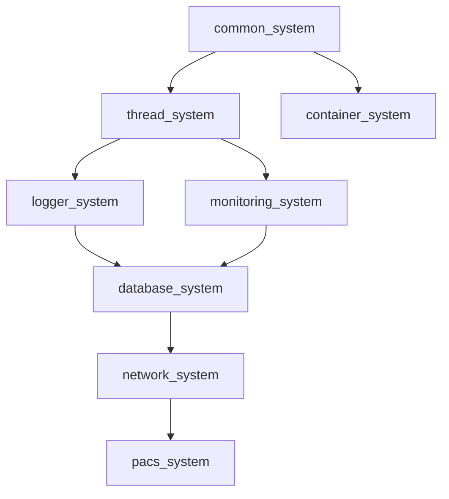

# Cross-Reference Convention Guide

> **SSOT**: This document is the single source of truth for the **ecosystem cross-reference convention**.

This guide defines the standard convention for linking between documents within a project and across ecosystem projects.

---

## Table of Contents

- [Purpose](#purpose)
- [Intra-Project Cross-References](#intra-project-cross-references)
- [Inter-Project Cross-References](#inter-project-cross-references)
- [Ecosystem Dependency Diagram](#ecosystem-dependency-diagram)
- [Placement Rules](#placement-rules)
- [Examples by Project](#examples-by-project)

---

## Purpose

A consistent cross-reference convention enables:

1. **Discoverability** — Readers can find related documentation without guessing file names
2. **Automated validation** — Link checkers can verify all references resolve correctly
3. **Interconnected documentation** — Documents form a navigable graph rather than isolated pages
4. **Maintenance** — Broken links from renames or deletions are easier to detect and fix

---

## Intra-Project Cross-References

Use blockquote format for references to other documents **within the same project**:

```markdown
> **Cross-reference**:
> [Architecture Guide](./ARCHITECTURE.md) — System architecture overview
> [API Reference](./API_REFERENCE.md) — Public API details
> [Benchmarks](./BENCHMARKS.md) — Performance measurement results
```

### Rules

- Use **relative paths** (e.g., `./ARCHITECTURE.md`) for portability
- Include a **brief description** of why the reference is relevant
- Use **section anchors** when linking to a specific part: `./ARCHITECTURE.md#threading-model`
- Place inside a `>` blockquote to visually distinguish from regular content

---

## Inter-Project Cross-References

Use blockquote format with **full GitHub URLs** for references to documents in other ecosystem projects:

```markdown
> **Ecosystem reference**:
> [common_system Result<T>](https://github.com/kcenon/common_system/blob/main/docs/API_REFERENCE.md) — Error handling base
> [thread_system Thread Pool](https://github.com/kcenon/thread_system/blob/main/docs/ARCHITECTURE.md) — Async execution
```

### Rules

- Use **full GitHub URLs** pointing to `blob/main/` for stable references
- Include the **project name** and **specific concept** in the link text
- Add a brief description explaining the dependency relationship
- Group ecosystem references under `> **Ecosystem reference**:` heading

---

## Ecosystem Dependency Diagram

Each project's README.md should include a Mermaid dependency diagram in the Ecosystem Integration section. The current project should be highlighted with a distinct style.

### Standard Diagram



### Highlighting the Current Project

Use Mermaid `style` to highlight the current project node:

```markdown
style X fill:#f9f,stroke:#333,stroke-width:3px
```

Where `X` is the node ID of the current project (e.g., `A` for common_system, `G` for network_system).

### Ecosystem Tier Reference

| Tier | Project | Role |
|------|---------|------|
| 0 | common_system | Foundation: Result&lt;T&gt;, interfaces, utilities |
| 1 | thread_system | Core: Thread pool, async execution |
| 1 | container_system | Core: Data serialization |
| 2 | logger_system | Service: Logging infrastructure |
| 3 | monitoring_system | Service: Metrics and observability |
| 3 | database_system | Service: Database abstraction |
| 4 | network_system | Integration: Transport layer |
| 5 | pacs_system | Application: DICOM/PACS |

---

## Placement Rules

1. **Place at section start** — Add cross-references at the beginning of a section that depends on another document
2. **Use blockquote (`>`)** — Visually distinguish references from regular content
3. **Include relevance description** — Explain why the reference matters to the current section
4. **Separate intra and inter** — Use `> **Cross-reference**:` for intra-project and `> **Ecosystem reference**:` for inter-project
5. **One diagram per README** — Add the Mermaid ecosystem diagram to the Ecosystem Integration section of each project's README.md

---

## Examples by Project

### common_system (Tier 0)

```markdown
> **Cross-reference**:
> [API Reference](./API_REFERENCE.md) — Result<T> type and interface definitions
> [Integration Policy](./INTEGRATION_POLICY.md) — Rules for downstream integration
```

### thread_system (Tier 1)

```markdown
> **Cross-reference**:
> [API Reference](./API_REFERENCE.md) — Thread pool and job queue APIs

> **Ecosystem reference**:
> [common_system API](https://github.com/kcenon/common_system/blob/main/docs/API_REFERENCE.md) — IExecutor interface implemented by thread_pool
```

### network_system (Tier 4)

```markdown
> **Cross-reference**:
> [API Reference](./API_REFERENCE.md) — Network component APIs
> [Integration Guide](./INTEGRATION.md) — Ecosystem adapter patterns

> **Ecosystem reference**:
> [common_system Result<T>](https://github.com/kcenon/common_system/blob/main/docs/API_REFERENCE.md) — Error handling
> [thread_system Thread Pool](https://github.com/kcenon/thread_system/blob/main/docs/ARCHITECTURE.md) — Async execution
> [container_system Serialization](https://github.com/kcenon/container_system/blob/main/docs/API_REFERENCE.md) — Message serialization
```
