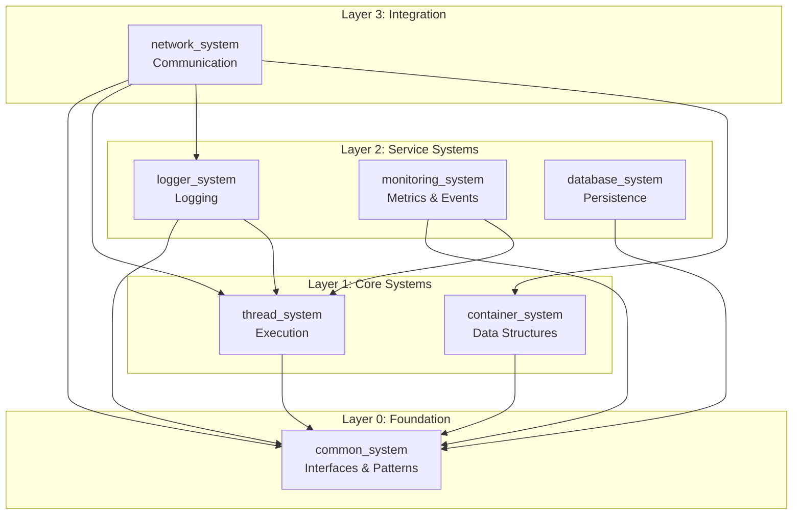

# System Architecture Current State

**Document Version**: 1.0
**Created**: 2025-10-07
**Phase**: Phase 0, Task 0.5
**Purpose**: Document current state of all systems before Phase 1 improvements

---

## Executive Summary

This document provides a comprehensive snapshot of the current state of the 7 interconnected C++ systems, including their dependencies, build configurations, testing status, and known issues. This baseline will be used to measure improvement progress throughout Phases 1-6.

**Key Metrics**:
- **Total Systems**: 7 (common_system, thread_system, logger_system, monitoring_system, container_system, database_system, network_system)
- **C++ Standard**: C++20 (unified across all systems as of 2025-10-02)
- **Build System**: CMake 3.20+
- **Integration Status**: BUILD_WITH_COMMON_SYSTEM enabled by default (as of 2025-10-03)
- **Documentation Status**: Basic READMEs exist, comprehensive integration docs created

---

## System Dependency Graph

### Layer Architecture



### Dependency Matrix

| System | Depends On | Used By | Dependency Type |
|--------|-----------|---------|-----------------|
| common_system | None | All systems | Required (interfaces) |
| thread_system | common_system | logger, monitoring, network | Required |
| container_system | common_system | network | Required |
| logger_system | common_system, thread_system | network | Required |
| monitoring_system | common_system, thread_system | - | Optional integration |
| database_system | common_system | messaging_system (external) | Optional integration |
| network_system | common, thread, logger, container | - | Integration layer |

### Circular Dependency Analysis

**Status**: ✅ No circular dependencies detected

**Historical Issues** (Resolved in subsystem Phase 1-3):
- ❌ logger ↔ thread ↔ monitoring (RESOLVED: Event-based integration)
- ❌ container → messaging (RESOLVED: Separated integration layer)

---

## System Details

### 1. common_system

**Purpose**: Foundation layer providing interfaces and patterns

**Current State**: ✅ Production Ready

**Key Components**:
- `ILogger`, `IExecutor`, `IMonitor` interfaces
- `Result<T>` error handling pattern
- `event_bus` for event-driven integration
- Smart adapters for zero-cost abstraction

**Statistics**:
- CMakeLists.txt: ~200 lines
- Header files: 9 core headers
- Test coverage: Unknown (Task 0.3)
- Build time: <10 seconds

**Recent Changes**:
- Phase 1: Integration verification completed
- Phase 2: Build system simplified
- Phase 3: Comprehensive documentation (4 major docs)

**Known Issues**:
- None critical

**Dependencies**:
- None

**Build Configuration**:
```cmake
cmake_minimum_required(VERSION 3.20)
project(common_system VERSION 1.0.0)
set(CMAKE_CXX_STANDARD 20)
set(CMAKE_CXX_STANDARD_REQUIRED ON)
```

---

### 2. thread_system

**Purpose**: Thread pool and job scheduling

**Current State**: ✅ Production Ready

**Key Components**:
- `thread_pool` - Worker pool implementation
- `job_queue` - Lock-free task queue
- `cancellation_token` - Task cancellation support
- `event_bus` - Thread-safe event system

**Statistics**:
- CMakeLists.txt: 167 lines (reduced from 955 in Phase 2)
- Source files: ~40 files
- Test coverage: Unknown
- Build time: ~30 seconds

**Recent Changes**:
- Phase 1: C++20 standard enforced
- Phase 2: CMake simplified (82.5% reduction)
- Phase 2: Deprecated legacy logger/executor interfaces

**Known Issues**:
- Potential thread safety issues (Phase 1 target)
- Monitoring interface unification needed (Phase 2, Task 2.3)

**Dependencies**:
- common_system (optional, default ON)
- fmt library (optional, fallback to std::format)

**Build Configuration**:
```cmake
option(BUILD_WITH_COMMON_SYSTEM "Enable common_system integration" ON)
option(THREAD_BUILD_TESTS "Build tests" ON)
option(THREAD_BUILD_EXAMPLES "Build examples" OFF)
```

**Performance Characteristics** (Baseline needed - Task 0.2):
- Task submission latency: TBD
- Throughput: TBD
- Resource usage: TBD

---

### 3. logger_system

**Purpose**: Flexible logging framework

**Current State**: ✅ Production Ready

**Key Components**:
- `logger` - Main logging class
- `file_writer`, `console_writer`, `async_writer` - Output backends
- `rotating_file_writer` - Log rotation support
- Log level filtering and formatting

**Statistics**:
- CMakeLists.txt: ~400 lines
- Source files: ~30 files
- Test coverage: Unknown
- Build time: ~25 seconds

**Recent Changes**:
- Phase 1: C++17 fallback removed, C++20 enforced
- Phase 2: Deprecated logger_from_common_adapter
- Phase 2: Extended ILogger interface

**Known Issues**:
- rotating_file_writer race conditions (Phase 1, Task 1.1)
- async_writer queue synchronization (Phase 1, Task 1.1)

**Dependencies**:
- common_system (required)
- thread_system (optional, for async logging)

**Build Configuration**:
```cmake
option(BUILD_WITH_COMMON_SYSTEM "Enable common_system integration" ON)
option(LOGGER_BUILD_TESTS "Build tests" ON)
option(LOGGER_BUILD_EXAMPLES "Build examples" OFF)
```

**Performance Characteristics** (Baseline needed):
- Log write latency: TBD
- Throughput: TBD (target: >100k messages/sec)
- File rotation overhead: TBD

---

### 4. monitoring_system

**Purpose**: Metrics collection and performance monitoring

**Current State**: ✅ Production Ready

**Key Components**:
- `performance_monitor` - Metric collection
- `event_bus` - Event-driven architecture
- `time_series` - Time-series data storage
- Collectors for CPU, memory, thread metrics

**Statistics**:
- CMakeLists.txt: ~250 lines
- Source files: ~25 files
- Test coverage: Unknown
- Build time: ~20 seconds

**Recent Changes**:
- Phase 1: Examples enabled in common_system mode
- Phase 1: Windows compatibility fixed
- Phase 1: C++20 enforced

**Known Issues**:
- event_bus thread safety (Phase 1, Task 1.3)
- collector concurrent access (Phase 1, Task 1.3)

**Dependencies**:
- common_system (optional, default ON)
- thread_system (optional)

**Build Configuration**:
```cmake
option(BUILD_WITH_COMMON_SYSTEM "Enable common_system integration" ON)
option(MONITORING_BUILD_TESTS "Build tests" ON)
option(MONITORING_BUILD_EXAMPLES "Build examples" OFF)
```

**Performance Characteristics** (Baseline needed):
- Metric collection overhead: TBD (target: <1%)
- Event publication latency: TBD

---

### 5. container_system

**Purpose**: High-performance container serialization

**Current State**: ✅ Production Ready

**Key Components**:
- `container` - Generic key-value container
- `value` - Type-safe value wrapper
- `simd_processor` - SIMD-accelerated operations
- `memory_pool` - Custom memory allocator

**Statistics**:
- CMakeLists.txt: ~400 lines
- Source files: ~35 files
- Test coverage: Unknown
- Build time: ~30 seconds

**Recent Changes**:
- Phase 1: Examples activated with common_system
- Phase 1: C++20 enforced
- Phase 2: Build system not yet simplified (pending)

**Known Issues**:
- thread_safe_container synchronization (Phase 1, Task 1.2)
- simd_processor concurrent access (Phase 1, Task 1.2)
- memory_pool thread safety (Phase 1, Task 1.2)

**Dependencies**:
- common_system (optional, default ON)

**Build Configuration**:
```cmake
option(BUILD_WITH_COMMON_SYSTEM "Enable common_system integration" ON)
option(CONTAINER_BUILD_TESTS "Build tests" ON)
option(CONTAINER_BUILD_EXAMPLES "Build examples" OFF)
```

**Performance Characteristics** (Baseline needed):
- Serialization speed: TBD
- Deserialization speed: TBD
- SIMD acceleration benefit: TBD

---

### 6. database_system

**Purpose**: Multi-backend database abstraction

**Current State**: ✅ Production Ready

**Key Components**:
- `database_manager` - Connection management
- `connection_pool` - Connection pooling
- Backend adapters: PostgreSQL, MySQL, SQLite, MongoDB, Redis

**Statistics**:
- CMakeLists.txt: ~400 lines
- Source files: ~25 files
- Test coverage: Unknown
- Build time: ~25 seconds

**Recent Changes**:
- Phase 1: DATABASE_USE_COMMON_SYSTEM flag removed
- Phase 1: BUILD_WITH_COMMON_SYSTEM standardized
- Phase 1: C++20 enforced

**Known Issues**:
- connection_pool synchronization (Phase 1, Task 1.5)
- async_operations thread safety (Phase 1, Task 1.5)

**Dependencies**:
- common_system (optional, default ON)
- libpq (PostgreSQL)
- mysqlclient (MySQL)
- sqlite3
- mongoc (MongoDB)
- hiredis (Redis)

**Build Configuration**:
```cmake
option(BUILD_WITH_COMMON_SYSTEM "Enable common_system integration" ON)
option(DATABASE_BUILD_TESTS "Build tests" ON)
option(DATABASE_BUILD_EXAMPLES "Build examples" OFF)
```

**Usage**:
- messaging_system (external project)

**Performance Characteristics** (Baseline needed):
- Query execution time: TBD (target: <100ms p99)
- Connection acquisition time: TBD

---

### 7. network_system

**Purpose**: Asynchronous network communication

**Current State**: ✅ Production Ready

**Key Components**:
- `messaging_client` - Client implementation
- `messaging_server` - Server implementation
- `messaging_session` - Session management
- `tcp_socket`, `udp_socket` - Transport layer

**Statistics**:
- CMakeLists.txt: 215 lines (reduced from 837 in Phase 2)
- Source files: ~40 files
- Test coverage: Unknown
- Build time: ~35 seconds

**Recent Changes**:
- Phase 1: USE_COMMON_SYSTEM renamed to BUILD_WITH_COMMON_SYSTEM
- Phase 1: IMonitor integration added
- Phase 2: CMake simplified (74.3% reduction)
- Phase 3: Default common_system integration enabled

**Known Issues**:
- session lifecycle management (Phase 1, Task 1.6)
- socket buffer access races (Phase 1, Task 1.6)

**Dependencies**:
- common_system (optional, default ON)
- thread_system (required)
- logger_system (required)
- container_system (required)
- Boost.Asio

**Build Configuration**:
```cmake
option(BUILD_WITH_COMMON_SYSTEM "Enable common_system integration" ON)
option(NETWORK_BUILD_TESTS "Build tests" ON)
option(NETWORK_BUILD_EXAMPLES "Build examples" OFF)
```

**Performance Characteristics** (Baseline needed):
- Message round-trip time: TBD (target: <10ms p99)
- Throughput: TBD
- Concurrent connections: TBD

---

## Build System Analysis

### CMake Complexity by System

| System | Lines | Complexity | Status |
|--------|-------|-----------|--------|
| common_system | ~200 | Low | ✅ Simplified (Phase 2) |
| thread_system | 167 | Low | ✅ Simplified (Phase 2, 82.5% reduction) |
| logger_system | ~400 | Medium | ⏳ To be simplified |
| monitoring_system | ~250 | Medium | ⏳ To be simplified |
| container_system | ~400 | Medium | ⏳ To be simplified |
| database_system | ~400 | Medium | ⏳ To be simplified |
| network_system | 215 | Low | ✅ Simplified (Phase 2, 74.3% reduction) |

**Target**: <250 lines per system (achieved: 3/7 systems)

### Build Flag Standardization

**Status**: ✅ Unified (as of Phase 1)

**Standard Flags**:
```cmake
option(BUILD_WITH_COMMON_SYSTEM "Enable common_system integration" ON)
option(<SYSTEM>_BUILD_TESTS "Build tests" ON)
option(<SYSTEM>_BUILD_EXAMPLES "Build examples" OFF)
```

**Deprecated Flags** (Removed):
- `DATABASE_USE_COMMON_SYSTEM` ✅
- `USE_COMMON_SYSTEM` ✅
- C++17 fallback logic ✅

---

## Testing Infrastructure

### Current Status

**Unit Tests**:
- ✅ All systems have basic unit tests
- ❓ Test coverage unknown (Task 0.3 needed)
- ❓ Test quality varies by system

**Integration Tests**:
- ⚠️ Limited integration test coverage
- ⚠️ No automated integration test suite
- ⚠️ Manual testing for cross-system functionality

**Performance Tests**:
- ❌ No baseline benchmarks (Task 0.2 needed)
- ❌ No performance regression detection
- ❌ No continuous performance monitoring

### Test Framework

**Primary Framework**: Google Test (gtest)

**Test Structure**:
```
<system>/
├── tests/
│   ├── unit/           # Unit tests
│   ├── integration/    # Integration tests (some systems)
│   └── CMakeLists.txt
```

---

## Documentation Status

### System-Level Documentation

| System | README | API Docs | Examples | Integration Guide |
|--------|--------|----------|----------|-------------------|
| common_system | ✅ | ⚠️ (Doxygen configured) | ⚠️ | ✅ (Phase 3) |
| thread_system | ✅ | ❌ | ❌ | ⚠️ |
| logger_system | ✅ | ❌ | ⚠️ | ⚠️ |
| monitoring_system | ✅ | ❌ | ✅ | ⚠️ |
| container_system | ✅ | ❌ | ✅ | ⚠️ |
| database_system | ✅ (comprehensive) | ❌ | ⚠️ | ⚠️ |
| network_system | ✅ | ❌ | ⚠️ | ⚠️ |

### Project-Level Documentation (Created in Phase 3)

- ✅ INTEGRATION_POLICY.md - 3-tier integration model
- ✅ ARCHITECTURE.md - System architecture and layers
- ✅ INTEGRATION.md - Quick start and patterns
- ✅ MIGRATION.md - Migration guide for Result<T> and interfaces

### Documentation Tools

- Doxygen configured (common_system)
- generate_docs.sh script created
- Markdown documentation integrated

---

## Known Issues Summary

### Critical Issues (Phase 1 Targets)

1. **Thread Safety** (All systems need verification):
   - logger_system: rotating_file_writer, async_writer
   - container_system: thread_safe_container, simd_processor, memory_pool
   - monitoring_system: event_bus, collectors
   - thread_system: thread_pool, job_queue
   - database_system: connection_pool
   - network_system: session lifecycle, socket buffers

2. **Resource Management**:
   - Connection pool leaks possible
   - Session cleanup during async I/O
   - Memory pool validation needed

### Major Issues (Phase 2-3 Targets)

3. **Error Handling**:
   - Result<T> not universally adopted
   - Exception-based errors still present
   - Error code registry not centralized

4. **Interface Duplication**:
   - ⏳ Monitoring interface unification in progress
   - ✅ Logger interface unified
   - ✅ Executor interface unified

5. **Performance**:
   - No baseline metrics (Task 0.2)
   - No regression detection
   - Adapter overhead unknown

---

## Performance Baseline (To Be Established)

### Target Metrics (Phase 0, Task 0.2)

**thread_system**:
- Task submission latency: <1ms (p99)
- Throughput: >10k tasks/sec
- Worker thread efficiency: >80%

**logger_system**:
- Log write latency: <100μs (p99)
- Throughput: >100k messages/sec
- File rotation overhead: <10ms

**monitoring_system**:
- Metric collection overhead: <1% of monitored operation
- Event publication latency: <10μs

**database_system**:
- Query execution time: <100ms (p99)
- Connection acquisition: <10ms

**network_system**:
- Message round-trip time: <10ms (p99)
- Throughput: >1k messages/sec
- Concurrent connections: >1000

**container_system**:
- Serialization: <1μs per field
- Deserialization: <1μs per field
- SIMD benefit: >2x baseline

---

## Build Environment

### Supported Platforms

- ✅ macOS 13+ (primary development)
- ✅ Ubuntu 22.04
- ⚠️ Windows Server 2022 (partial support)

### Compiler Support

- ✅ Clang 15+ (primary)
- ✅ GCC 12+
- ⚠️ MSVC 2022 (limited testing)

### Required Tools

**Installed**:
- CMake 3.20+
- C++20 compiler
- Git

**Not Installed** (Phase 0 needs):
- clang-tidy (static analysis)
- cppcheck (static analysis)
- lcov (coverage)
- Google Benchmark (performance)

---

## Next Steps (Phase 0 Completion)

### Immediate Actions

1. ✅ Document current state (this document)
2. ✅ Document static analysis baseline
3. ⏳ Install missing tools (clang-tidy, cppcheck, lcov)
4. ⏳ Establish performance baseline (Task 0.2)
5. ⏳ Measure test coverage (Task 0.3)
6. ⏳ Set up CI/CD pipeline (Task 0.1)

### Phase 1 Preparation

- Review this document with team
- Prioritize thread safety issues
- Assign systems to developers
- Set up development environment with sanitizers

---

## References

- Main NEED_TO_FIX.md - Architecture improvement plan
- INTEGRATION_POLICY.md - Integration model
- ARCHITECTURE.md - System architecture
- STATIC_ANALYSIS_BASELINE.md - Static analysis configuration

---

## Revision History

| Version | Date | Author | Changes |
|---------|------|--------|---------|
| 1.0 | 2025-10-07 | System | Initial current state documentation |

---

**Status**: Draft - Pending performance baseline and coverage measurement
**Next Review**: After Phase 0 completion
**Owner**: Architecture Team
