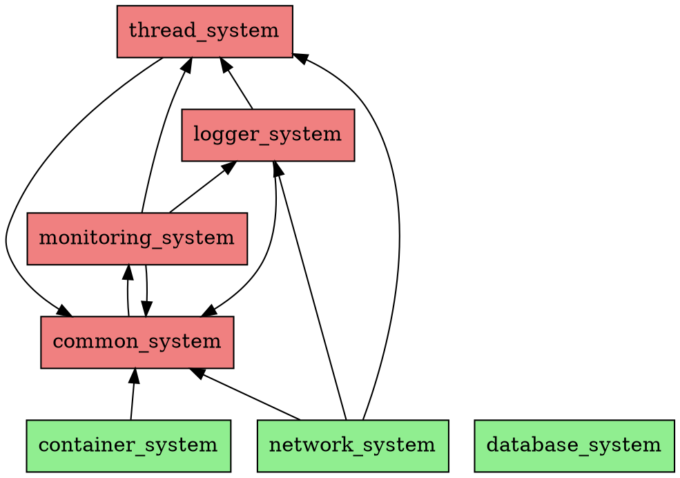

# Dependency Analysis Report

**Date**: 2025-10-10
**Phase**: Phase 4 - Dependency Refactoring
**Analyzer**: dependency_analyzer.py

---

## Executive Summary

- **Total Systems**: 7
- **Total Dependencies**: 11
- **Average Dependencies per System**: 1.6

- **Circular Dependencies Found**: 3

### ⚠️ Circular Dependencies Detected

1. common_system → monitoring_system → logger_system → thread_system → common_system
2. common_system → monitoring_system → logger_system → thread_system → container_system → common_system
3. thread_system → container_system → network_system → thread_system

---

## Dependency Levels

**Level 0** (Foundation - No Dependencies):
- container_system
- database_system
- network_system

**Cyclic** (Part of circular dependency):
- common_system → [monitoring_system]
- logger_system → [common_system, thread_system]
- monitoring_system → [common_system, logger_system, thread_system]
- thread_system → [common_system]

---

## Detailed Dependency Breakdown

### common_system

**CMake Dependencies**: None
**Include Dependencies**: monitoring_system
**Total Dependencies**: 1
**⚠️ Include-only** (not in CMake): monitoring_system

### container_system

**CMake Dependencies**: None
**Include Dependencies**: common_system
**Total Dependencies**: 1
**⚠️ Include-only** (not in CMake): common_system

### database_system

**Status**: Foundation system (no dependencies)

### logger_system

**CMake Dependencies**: common_system, thread_system
**Include Dependencies**: common_system, thread_system
**Total Dependencies**: 2

### monitoring_system

**CMake Dependencies**: common_system, logger_system, thread_system
**Include Dependencies**: common_system, thread_system
**Total Dependencies**: 3
**⚠️ CMake-only** (not in includes): logger_system

### network_system

**CMake Dependencies**: None
**Include Dependencies**: common_system, logger_system, thread_system
**Total Dependencies**: 3
**⚠️ Include-only** (not in CMake): common_system, logger_system, thread_system

### thread_system

**CMake Dependencies**: None
**Include Dependencies**: common_system
**Total Dependencies**: 1
**⚠️ Include-only** (not in CMake): common_system

---

## Refactoring Recommendations

### Priority 1: Break Circular Dependencies

**Strategy**: Dependency Injection via Interfaces

#### Cycle 1: common_system → monitoring_system → logger_system → thread_system → common_system

**Recommended Approach**:

1. Create interface in `common_system`:
```cpp
namespace common::interfaces {
    class ICommon {
        virtual ~I() = default;
        // Abstract interface methods
    };
}
```

2. Inject dependency instead of direct linking
3. Update CMakeLists.txt to remove circular link

#### Cycle 2: common_system → monitoring_system → logger_system → thread_system → container_system → common_system

**Recommended Approach**:

1. Create interface in `common_system`:
```cpp
namespace common::interfaces {
    class ICommon {
        virtual ~I() = default;
        // Abstract interface methods
    };
}
```

2. Inject dependency instead of direct linking
3. Update CMakeLists.txt to remove circular link

#### Cycle 3: thread_system → container_system → network_system → thread_system

**Recommended Approach**:

1. Create interface in `common_system`:
```cpp
namespace common::interfaces {
    class IThread {
        virtual ~I() = default;
        // Abstract interface methods
    };
}
```

2. Inject dependency instead of direct linking
3. Update CMakeLists.txt to remove circular link

### Priority 2: Check Layer Violations

**⚠️ Potential Layer Violations Detected:**

- common_system (L0) → monitoring_system (L2)
- logger_system (L1) → thread_system (L1)

---

## Dependency Graph (Graphviz DOT)



**Legend**:
- Green: Foundation (no dependencies)
- Yellow: Level 1 (depends only on foundation)
- Blue: Level 2+ (higher-level systems)
- Red: Part of circular dependency

---

**Analysis Complete**: 2025-10-10
**Next Steps**: Review cycles and plan refactoring
