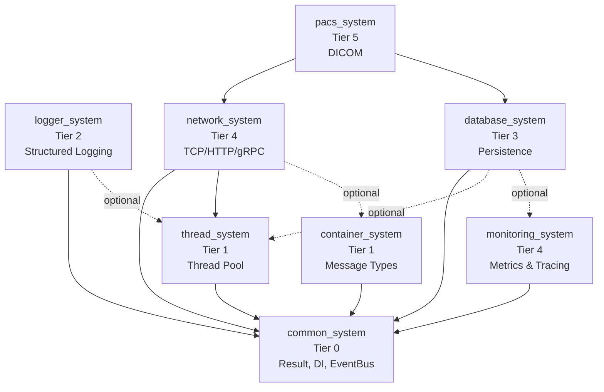

# Ecosystem Integration Tutorial

> **Build a monitored network service using all 8 kcenon ecosystem systems step by step.**

This tutorial walks through integrating common_system, thread_system, logger_system, container_system, network_system, database_system, monitoring_system, and optionally pacs_system into a single working application.

---

## Table of Contents

- [Prerequisites](#prerequisites)
- [Architecture Overview](#architecture-overview)
- [Step 1: common_system Foundation](#step-1-common_system-foundation)
- [Step 2: thread_system Worker Pool](#step-2-thread_system-worker-pool)
- [Step 3: logger_system Structured Logging](#step-3-logger_system-structured-logging)
- [Step 4: container_system Message Types](#step-4-container_system-message-types)
- [Step 5: network_system TCP Server](#step-5-network_system-tcp-server)
- [Step 6: database_system Persistence](#step-6-database_system-persistence)
- [Step 7: monitoring_system Metrics](#step-7-monitoring_system-metrics)
- [Step 8: pacs_system DICOM (Optional)](#step-8-pacs_system-dicom-optional)
- [vcpkg Manifest](#vcpkg-manifest)
- [CMake Integration](#cmake-integration)

---

## Prerequisites

- C++20 compiler (GCC 13+, Clang 17+, MSVC 2022+)
- CMake 3.28+
- vcpkg (for dependency management)
- Basic familiarity with each system (see each repo's Quick Start)

---

## Architecture Overview



The tiered architecture ensures each system depends only on lower tiers, preventing circular dependencies.

---

## Step 1: common_system Foundation

Start by setting up the DI container and Result<T> pattern.

**File: `src/main.cpp`**

```cpp
#include <kcenon/common/di/service_container.h>
#include <kcenon/common/patterns/result.h>
#include <iostream>

using namespace kcenon::common;
using namespace kcenon::common::di;

int main() {
    auto& container = service_container::global();

    // Application entry point returns Result<int> for error handling
    auto startup = []() -> Result<int> {
        std::cout << "Ecosystem service starting...\n";
        return ok(0);
    };

    auto result = startup();
    if (result.is_err()) {
        std::cerr << "Startup failed: " << result.error().message << "\n";
        return 1;
    }

    return result.value();
}
```

**CMakeLists.txt snippet:**

```cmake
find_package(kcenon-common-system CONFIG REQUIRED)
target_link_libraries(app PRIVATE kcenon::common)
target_compile_features(app PRIVATE cxx_std_20)
```

---

## Step 2: thread_system Worker Pool

Add a thread pool for async work.

```cpp
#include <kcenon/thread/thread_pool.h>

auto pool = std::make_shared<kcenon::thread::thread_pool>(4);

// Register as IExecutor in DI container
container.register_instance<IExecutor>(pool);

// Submit work
auto future = pool->submit([]() {
    std::cout << "Running on worker thread\n";
    return 42;
});
int result = future.get();
```

**CMakeLists:**

```cmake
find_package(kcenon-thread-system CONFIG REQUIRED)
target_link_libraries(app PRIVATE kcenon::common kcenon::thread)
```

---

## Step 3: logger_system Structured Logging

Add structured logging with context propagation.

```cpp
#include <kcenon/logger/core/logger.h>
#include <kcenon/logger/core/logger_builder.h>
#include <kcenon/logger/writers/console_writer.h>

auto logger = kcenon::logger::logger_builder()
    .with_writer(std::make_shared<kcenon::logger::console_writer>())
    .with_async(true)
    .build();

container.register_instance<ILogger>(logger);

logger->info("Service started", {{"version", "1.0.0"}, {"pid", std::to_string(getpid())}});
```

**CMakeLists:**

```cmake
find_package(kcenon-logger-system CONFIG REQUIRED)
target_link_libraries(app PRIVATE kcenon::logger)
```

---

## Step 4: container_system Message Types

Define type-safe message containers for IPC.

```cpp
#include "container.h"

using namespace kcenon::container;

value_container request_msg;
request_msg.set("request_id", static_cast<int64_t>(12345));
request_msg.set("action", std::string("get_user"));
request_msg.set("user_id", static_cast<int64_t>(42));

// Serialize for network transmission
auto binary = serializer_factory::create(serialization_format::binary);
auto bytes = binary->serialize(request_msg);
```

---

## Step 5: network_system TCP Server

Create a TCP server using the facade API.

```cpp
#include <kcenon/network/facade/tcp_facade.h>

using namespace kcenon::network::facade;

tcp_facade::server_config srv_config;
srv_config.port = 9090;
srv_config.server_id = "ecosystem-demo";

auto server = tcp_facade::create_server(srv_config);
server->on_message([&](const auto& msg) {
    logger->info("Received request", {{"size", std::to_string(msg.size())}});
    // Process request...
});
server->start();
```

---

## Step 6: database_system Persistence

Add database persistence with connection pooling.

```cpp
#include <kcenon/database/database_manager.h>
#include <kcenon/database/core/database_context.h>

auto& db = kcenon::database::database_manager::handle();

kcenon::database::connection_pool_config pool_cfg;
pool_cfg.min_connections = 5;
pool_cfg.max_connections = 50;
pool_cfg.connection_string = "host=localhost dbname=mydb";

db.create_connection_pool(kcenon::database::database_types::postgres, pool_cfg);

auto conn = db.get_connection_pool(kcenon::database::database_types::postgres)
               ->acquire_connection();
auto result = conn->select_query("SELECT * FROM users WHERE id = 42");
```

---

## Step 7: monitoring_system Metrics

Wire up metrics, health checks, and tracing.

```cpp
#include <kcenon/monitoring/core/performance_monitor.h>
#include <kcenon/monitoring/health/health_monitor.h>

auto perf_monitor = std::make_shared<kcenon::monitoring::performance_monitor>();
auto health_monitor = std::make_shared<kcenon::monitoring::health_monitor>();

container.register_instance<IMetricCollector>(perf_monitor);

// Record request metrics
perf_monitor->record_counter("requests.total", 1);
perf_monitor->record_histogram("requests.latency_ms", 23.5);
```

---

## Step 8: pacs_system DICOM (Optional)

For medical imaging applications, add DICOM support.

```cpp
#include <kcenon/pacs/core/dicom_file.h>

auto dicom = kcenon::pacs::dicom_file::read("image.dcm");
if (dicom.is_ok()) {
    auto patient_name = dicom.value().get_tag("0010,0010");
}
```

---

## vcpkg Manifest

**File: `vcpkg.json`**

```json
{
  "name": "ecosystem-demo",
  "version": "0.1.0",
  "dependencies": [
    "kcenon-common-system",
    "kcenon-thread-system",
    "kcenon-logger-system",
    "kcenon-container-system",
    "kcenon-network-system",
    "kcenon-database-system",
    "kcenon-monitoring-system"
  ]
}
```

---

## CMake Integration

**File: `CMakeLists.txt`**

```cmake
cmake_minimum_required(VERSION 3.28)
project(ecosystem_demo VERSION 0.1.0 LANGUAGES CXX)

set(CMAKE_CXX_STANDARD 20)
set(CMAKE_CXX_STANDARD_REQUIRED ON)

# All 7 core systems
find_package(kcenon-common-system CONFIG REQUIRED)
find_package(kcenon-thread-system CONFIG REQUIRED)
find_package(kcenon-logger-system CONFIG REQUIRED)
find_package(kcenon-container-system CONFIG REQUIRED)
find_package(kcenon-network-system CONFIG REQUIRED)
find_package(kcenon-database-system CONFIG REQUIRED)
find_package(kcenon-monitoring-system CONFIG REQUIRED)

add_executable(ecosystem_demo src/main.cpp)

target_link_libraries(ecosystem_demo PRIVATE
    kcenon::common
    kcenon::thread
    kcenon::logger
    kcenon::container
    kcenon::network
    kcenon::database
    kcenon::monitoring
)
```

---

## Related Documentation

- [Ecosystem Cookbook](../cookbook/ECOSYSTEM_COOKBOOK.md) — Recipe-style integration patterns
- [Integration Guide](../INTEGRATION_GUIDE.md) — In-depth integration reference
- [Production Guide](../PRODUCTION_GUIDE.md) — Production deployment patterns
